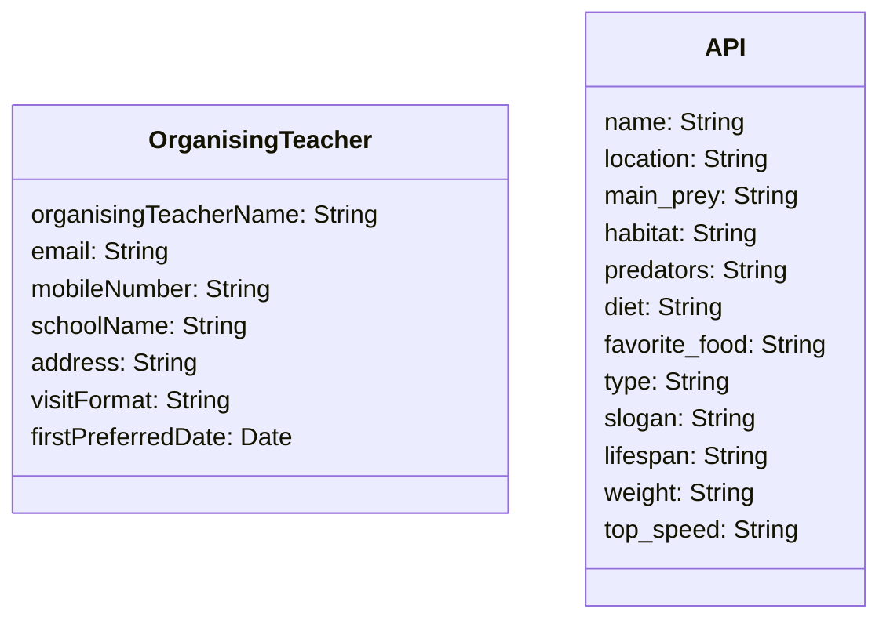

```mermaid
classDiagram
  class OrganisingTeacher {
    organisingTeacherName: String
    email: String
    mobileNumber: String
    schoolName: String
    address: String
    visitFormat: String
    firstPreferredDate: Date
  }

  class API {
    name: String
    location: String
    main_prey: String
    habitat: String
    predators: String
    diet: String
    favorite_food: String
    type: String
    slogan: String
    lifespan: String
    weight: String
    top_speed: String
  }
```