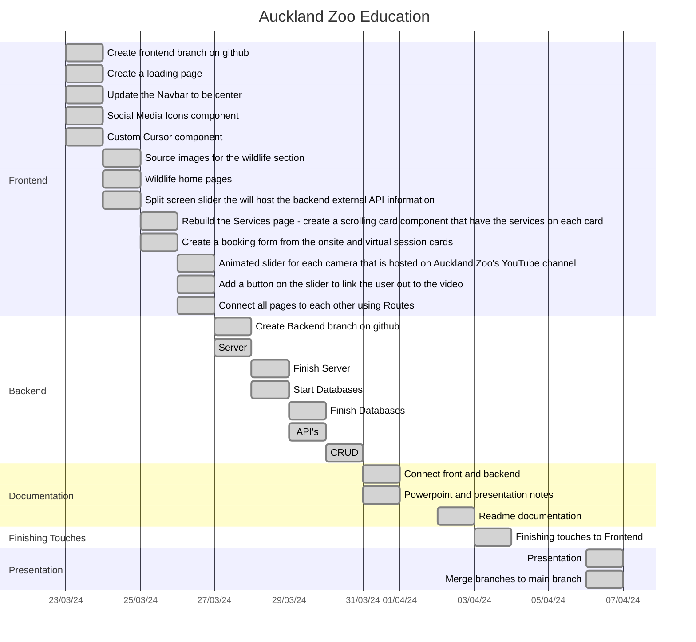

```mermaid
gantt
    title Auckland Zoo Education
    dateFormat  DD/MM/YY
    axisFormat %d/%m/%y

    section Frontend
    Create frontend branch on github                 :done, f1, 23/03/24, 1d
    Create a loading page                             :done, f2, 23/03/24, 1d
    Update the Navbar to be center                    :done, f3, 23/03/24, 1d
    Social Media Icons component                      :done, f4, 23/03/24, 1d
    Custom Cursor component                           :done, f5, 23/03/24, 1d
    Source images for the wildlife section            :done, f6, 24/03/24, 1d
    Wildlife home pages                               :done, f7, 24/03/24, 1d
    Split screen slider the will host the backend external API information:done, f8, 24/03/24, 1d
    Rebuild the Services page - create a scrolling card component that have the services on each card:done, f9, 25/03/24, 1d
    Create a booking form from the onsite and virtual session cards:done, f10, 25/03/24, 1d
    Animated slider for each camera that is hosted on Auckland Zoo's YouTube channel:done, f11, 26/03/24, 1d
    Add a button on the slider to link the user out to the video:done, f12, 26/03/24, 1d
    Connect all pages to each other using Routes      :done, f13, 26/03/24, 1d

    section Backend
    Create Backend branch on github                   :done, b1, 27/03/24, 1d
    Server                                            :done, b2, 27/03/24, 1d
    Finish Server                                     :done, b3, 28/03/24, 1d
    Start Databases                                   :done, b4, 28/03/24, 1d
    Finish Databases                                  :done, b5, 29/03/24, 1d
    API's                                             :done, b6, 29/03/24, 1d
    CRUD                                              :done, b7, 30/03/24, 1d

    section Documentation
    Connect front and backend                         :done, d1, 31/03/24, 1d
    Powerpoint and presentation notes                :done, d2, 31/03/24, 1d
    Readme documentation                              :done, d3, 02/04/24, 1d

    section Finishing Touches
    Finishing touches to Frontend                    :done, ft1, 03/04/24, 1d

    section Presentation
    Presentation                                      :done, p1, 06/04/24, 1d
    Merge branches to main branch                     :done, p2, 06/04/24, 1d
```