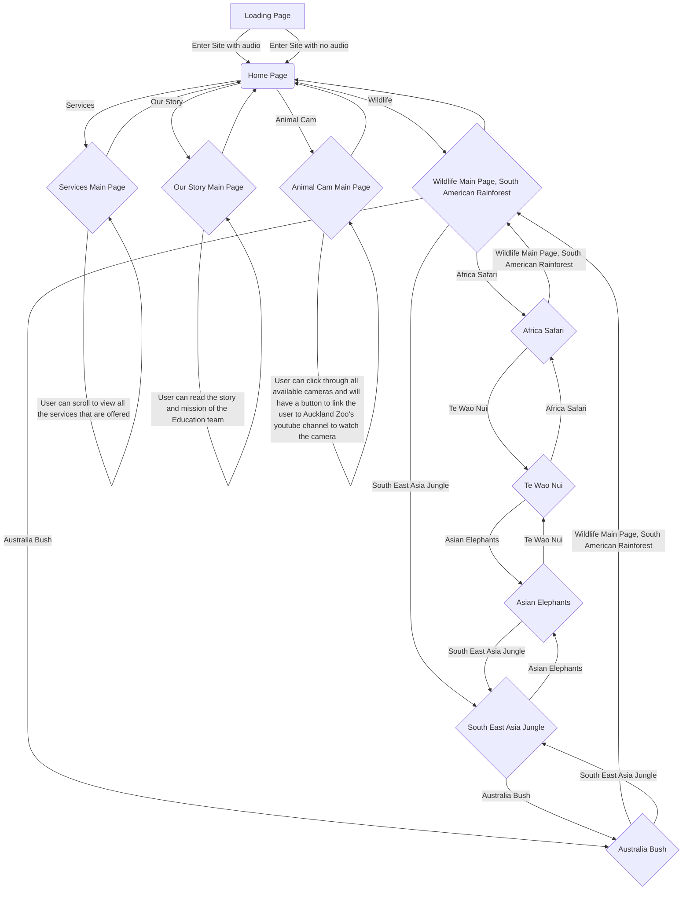

```mermaid
flowchart TD
    A[Loading Page] -->|Enter Site with audio| B(Home Page)
    A[Loading Page] -->|Enter Site with no audio| B(Home Page)
    B --> |Wildlife| C{Wildlife Main Page, South American Rainforest} --> B(Home Page)
    B --> |Services| D{Services Main Page} --> B(Home Page)
    B --> |Our Story| E{Our Story Main Page} --> B(Home Page)
    B --> |Animal Cam| F{Animal Cam Main Page} --> B(Home Page)
    C --> |Africa Safari|G{Africa Safari}
    C --> |Australia Bush|H{Australia Bush}
    C --> |South East Asia Jungle|I{South East Asia Jungle}
    G --> |Te Wao Nui|J{Te Wao Nui}
    G --> |Wildlife Main Page, South American Rainforest|C
    H --> |Wildlife Main Page, South American Rainforest|C
    H --> |South East Asia Jungle|I
    I --> |Australia Bush|H
    I --> |Asian Elephants|K{Asian Elephants}
    J --> |Africa Safari|G
    J --> |Asian Elephants|K
    K --> |Te Wao Nui|J
    K --> |South East Asia Jungle|I
    D --> |User can scroll to view all the services that are offered| D
    E --> |User can read the story and mission of the Education team| E
    F --> |User can click through all available cameras and will have a button to link the user to Auckland Zoo's youtube channel to watch the camera| F
```