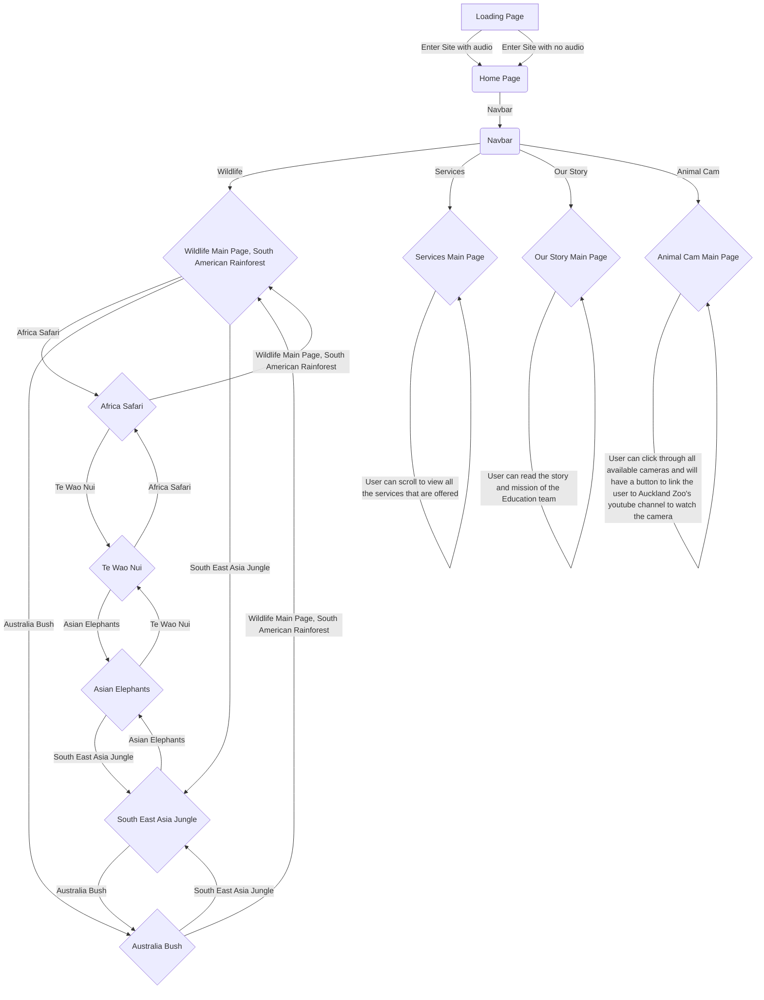

```mermaid
flowchart TD
    A[Loading Page] -->|Enter Site with audio| B(Home Page)
    A[Loading Page] -->|Enter Site with no audio| B(Home Page)
    B --> |Navbar| G(Navbar)
    G --> |Wildlife| C{Wildlife Main Page, South American Rainforest} 
    G --> |Services| D{Services Main Page} 
    G --> |Our Story| E{Our Story Main Page} 
    G --> |Animal Cam| F{Animal Cam Main Page} 
    C --> |Africa Safari|H{Africa Safari}
    C --> |Australia Bush|I{Australia Bush}
    C --> |South East Asia Jungle|J{South East Asia Jungle}
    H --> |Te Wao Nui|K{Te Wao Nui}
    H --> |Wildlife Main Page, South American Rainforest|C
    I --> |Wildlife Main Page, South American Rainforest|C
    I --> |South East Asia Jungle|J
    J --> |Australia Bush|I
    J --> |Asian Elephants|L{Asian Elephants}
    K --> |Africa Safari|H
    K --> |Asian Elephants|L
    L --> |Te Wao Nui|K
    L --> |South East Asia Jungle|J
    D --> |User can scroll to view all the services that are offered| D
    E --> |User can read the story and mission of the Education team| E
    F --> |User can click through all available cameras and will have a button to link the user to Auckland Zoo's youtube channel to watch the camera| F
```