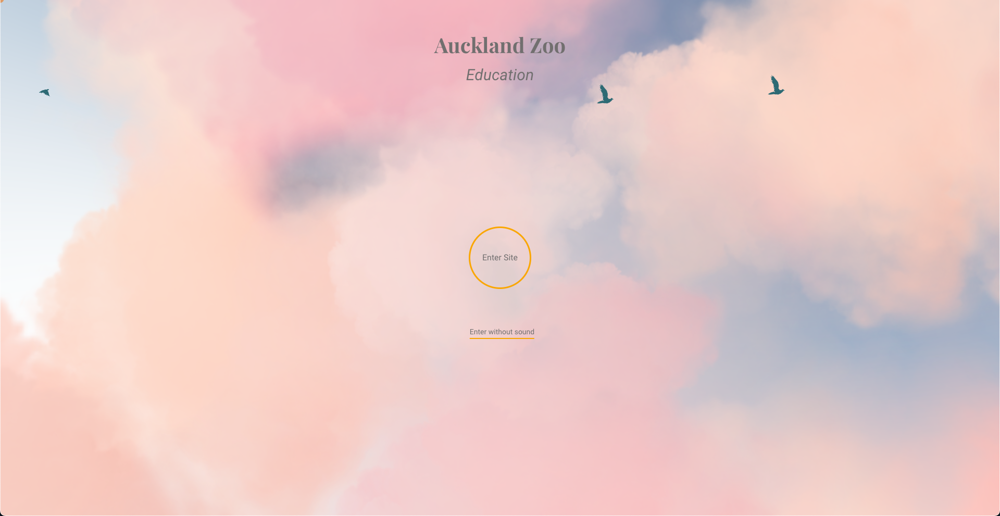

# 

> 


## 🚩 Table of Contents

- [Why Auckland Zoo Education?](#-why-auckland-zoo-education)
- [Features](#-features)
- [Built With](#-built-with)
- [Browser Support](#-browser-support)
- [Installation](#-installation)
- [Database](#-database)
- [Acknowledgments](#-acknowledgments)


## 🐵 Why Zoo education?

Problem:<br>
The challenge lies in designing a website that not only serves as a tool during teaching sessions but also offers valuable resources for students to explore further after their visit. Capturing and maintaining students' interest is crucial, as it can be challenging to retain their engagement once the formal session ends. Ensuring the content is captivating and enjoyable is essential for encouraging ongoing learning beyond the classroom.<br>

Solution:<br>
To address this challenge, the website can be designed with interactive elements, engaging visuals, and user-friendly navigation. Including features such as multimedia content can make the learning experience more enjoyable and encourage students to explore further. Providing easy access to additional resources, such as activities related to the session topics, can also help maintain students' interest and motivation.<br>

Value:<br>
By creating an engaging online platform, the website can enhance the overall learning experience for students. It can serve as a valuable resource for both teachers and students, providing supplementary materials and activities to enrich the educational content. By maintaining students' interest and motivation to continue learning, even after their session ends, the website can help foster a culture of lifelong learning and exploration.

## 🎨 Features

* Navigation Bar: This hosts all the pages that are currently available on the website
* Booking Form: A booking form that allows the user to book a session and the information is then stored in your MongoDB database
* Screen Slider: There is a split screen slider that host a picture of a particular animal with the corresponding animal information that is pulled from the external API
* Background Audio: Sounds of the jungle is hosted on the home page and our story page. Users have the ability to mute and unmute the audio.

## 🔨 Built With
* 
* 
* 
* 
* 
* 
* 
* 


## 🌏 Browser Support

|  Chrome |  Internet Explorer |  Edge |  Safari |  Firefox |
| :---------: | :---------: | :---------: | :---------: | :---------: |
| Yes | 11+ | Yes | Yes | Yes |


## 🔧 Installation

Run npm scripts and develop yourself with the following process.

### Setup

Fork `main` branch into your personal repository. Clone it to local computer. Install node modules. Before starting development, you should check if there are any errors.

```sh
$ git clone https://github.com/{your-personal-repo}/capstone-a10mal.git
$ npm install
$ npm start
```


### API KEY
Create a free login on API Ninjas to get your own API Key
```sh
https://api-ninjas.com/signin
```

Create a .env file
```sh
API_URL=https://api.api-ninjas.com/v1/animals?name=
API_KEY={your-personal-api-key}
MONGODB_URI={your-personal-mongo-database-name}
```


## 🖥️ Database

Two distinct sets of data is being managed in the MongoDB database. One set of data pertains to user bookings for onsite and virtual sessions offered by my education team, which are facilitated through a booking form on my website. The information submitted through this form is stored in MongoDB.

Additionally, an external API is integrated into my website, which provides information about animals. I am fetching data from this API and storing it in my MongoDB database. 


## 🖼️ UI Design
* Loading Page
<br></br>
* Home Page
<br></br>
* Wildlife Section
<br></br>
* Animal Information
<br></br>
* Services
<br>
<br></br>
* Booking Form
<br></br>
* Our Story
<br></br>
* Animal Cam
<br></br>


## Acknowledgments
I utilised Unsplash for my high def images being used on the webpage. Below are the users whose images I have used:

* [waldemarbrandt67w - Lion](https://unsplash.com/photos/a-large-lion-sitting-on-top-of-a-rock-YOowNEyHIR0)
* [RPM FX - Squirrel Monkey](https://unsplash.com/photos/a-monkey-sitting-on-top-of-a-rope-10P7e_6e3VM)
* [Victoria Naumenko - Tarantula](https://unsplash.com/photos/brown-and-black-spider-on-gray-surface-juNFkPiHkHE)
* [Chintala Makombo - Emperor Tamarin](https://unsplash.com/photos/black-and-white-monkey-in-close-up-photography-TJK4DZC20Xc)
* [matdflo - Golden Lion Tamarin](https://unsplash.com/photos/brown-furry-monkey-on-branch-5uIkDWUQ8io)
* [bradmills - Alligator](https://unsplash.com/photos/crocodile-on-body-of-water-during-daytime-HfZxgmEntHs)
* [soberanes - Spider Monkey](https://unsplash.com/photos/black-monkey-sitting-on-tree-slab-2Ievc7BjuI4)
* [sandym10 - Cotton Top Tamarin](https://unsplash.com/photos/white-and-brown-monkey-sitting-on-the-tree-branch-RwyPpzbJuck)
* [davidclode - Safari](https://unsplash.com/photos/green-leaf-trees-92MgFhlWD-8)
* [Fabio Fistarol - Rainforest](https://unsplash.com/photos/green-trees-under-white-sky-during-daytime-adLo80F_9P0)

<p align="right">(<a href="#readme-top">back to top</a>)</p>
